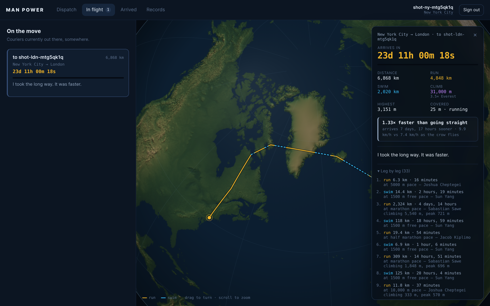

# Man Power

Carrier-pigeon messaging, except the courier is the fastest human alive.

Send a message and it does not appear in the recipient's inbox until enough real
time has passed for a world-record athlete to have physically covered the
distance between you — running every landmass, swimming every sea, over real
terrain, by the fastest route they could take. New York to London takes about
**23 days**, and the courier goes by way of Greenland. There is no way to hurry
it.

**→ [Time a journey yourself](https://danielluzhu.github.io/man-power/)** — the
project site runs the real routing engine in your browser, no server involved.



---

## The idea

A carrier pigeon flies at roughly 80 km/h. A human does not. This app takes that
premise seriously and asks what messaging would feel like if the fastest person
who has ever lived had to carry every message by hand.

So a message is not transmitted. It is **carried**. The server searches for the
fastest way across the world between sender and recipient — over mountains,
around them, along coastlines, across straits — splits that path into legs of
land and water, times each leg against the world record for its distance and
surface with terrain applied along the way, and seals the message until the sum
of those legs has elapsed. Until then the recipient can watch the courier's
position on a globe and see how far they have left, but the body of the message
is not on their machine at all.

## The pace model

Records are applied as **pace**, not as a flat duration. A 400 m hop does not
take Josh Kerr's full 3:42.66; it takes 400 m *at* his mile pace. This is the
only reading that stays coherent at the long end, where the marathon record has
to cover journeys of thousands of kilometres.

**On land — running.** The ladder runs from the mile to the marathon:

| Distance | Time | Held by |
|---|---|---|
| 1 mile | 3:42.66 | Josh Kerr (GBR) |
| 2000 m | 4:43.13 | Hicham El Guerrouj (MAR) |
| 3000 m | 7:17.55 | Daniel Komen (KEN) |
| 5000 m | 12:35.36 | Joshua Cheptegei (UGA) |
| 10,000 m | 26:11.00 | Joshua Cheptegei (UGA) |
| 15 km | 40:16 | Jacob Kiplimo (UGA) |
| half marathon | 56:42 | Jacob Kiplimo (UGA) |
| 25 km | 1:10:30 | Dennis Kimetto (KEN) |
| marathon | 1:59:30 | Sabastian Sawe (KEN) |

Anything shorter than a mile holds Kerr's mile pace. Anything past 26.2 miles
holds Sawe's marathon pace, however far it goes — which is what makes a
transcontinental leg tractable at all.

**On water — swimming.** Long-course freestyle world records, 50 m through
1500 m (César Cielo, Pan Zhanle, Paul Biedermann, Lukas Märtens, Zhang Lin, Sun
Yang). Beyond 1500 m — the longest distance with a standing record — pace holds
at Sun Yang's, whatever the width of the ocean.

**Between the records**, pace is interpolated linearly in log(distance) vs
log(time) space — the standard endurance-curve relationship. The curve passes
exactly through every record above and bends smoothly between them.

### A note on three omitted records

The 2 mile, 10 mile and 30 km bests are all *slower in pace terms* than their
neighbours on the ladder (a sub-two-hour marathon outpaces the standing 30 km
best, for instance). Including them would make the curve non-monotonic, meaning
a longer journey could be delivered sooner than a shorter one along the same
route. They are left off, and `assertMonotonic()` fails at import time if the
ladder ever stops being strictly decreasing in speed.

## The route the courier takes

Not the shortest path — the **soonest**. A least-time search over a grid of the
world, where each step costs whatever it costs to cross.

That single objective produces every behaviour worth having, none of it
special-cased:

| Route | What it does | Result |
|---|---|---|
| Madrid → Casablanca | crosses at Gibraltar instead of swimming wide | 328 km of swimming becomes 26 km; **41% faster** |
| New York → London | hops Baffin Island, Greenland and Iceland | no open-water leg over 844 km; **25% faster** |
| Lima → New York | hugs the Americas rather than cutting the Caribbean | **36% faster** |
| Delhi → Beijing | rounds the Himalaya through the Tarim Basin | 6,000 m less climbing |
| New York → Los Angeles | nothing worth going around | the straight line, unchanged |

Swimming is 3.4× slower than running, so a route will go hundreds of kilometres
out of its way to find a narrow crossing. Climbing costs time and thin air costs
more, so it prefers to go around a range than over it.

### How it works

1. **Plan** on a 0.2° grid (1800 × 900 cells) with A*, where every step is
   priced in seconds — flat ground, a mountainside, or open water.
2. **Measure** the chosen path against the original 0.1° mask and elevation
   data, so the search stays cheap but the reported numbers keep their
   resolution. Coast crossings are bisected to ~50 m.
3. **Time** each leg against the world record for *its* distance, with gradient
   and altitude applied segment by segment along it.

Because legs are timed independently, a 600 m river crossing is swum at 800 m
pace while the 4000 km either side is run at marathon pace. The app shows the
full itinerary leg by leg, with the record governing each one and the climbing
it involves.

Three details make the search work:

- **The heuristic.** Plain A* is hopeless here — a straight-line heuristic
  divided by top speed underestimates ocean crossings fourfold, so it fans out
  across an entire ocean before committing. The heuristic instead comes from a
  full Dijkstra run backwards from the destination over a 1° grid (64,800 cells,
  a few milliseconds), built optimistically so it stays admissible. It knows
  where the land bridges are.
- **Sixteen neighbours, not eight.** Eight restricts travel to multiples of 45°,
  and the resulting staircase runs up to 8.2% longer than the line it
  approximates — enough to lose to a plain straight line on a flat continental
  crossing. Sixteen headings cut that to 2.6%.
- **String pulling.** A final pass tests whether skipping ahead is faster,
  measured with the same model that times the finished route, so it can only
  improve the answer.

Together these earn the invariant the test suite enforces: **a planned route is
never slower than the direct line.** Before these fixes it lost by up to 5%.

Every route is measured against that alternative and reports the difference, so
the claim is always visible rather than asserted:

> **1.65× faster than going straight**
> 45 days, 6 hours instead of 74 days, 14 hours — arrives 29 days, 8 hours sooner
> 10.4 km/h vs 6.3 km/h as the crow flies
> swims 4,040 km instead of 11,003 km

Both routes are timed by the same pipeline over the same terrain, so the
difference is attributable to the choice of path and nothing else. Where there
is nothing worth going around, it says so instead of claiming a 1.00× gain.

Endpoints are always treated as land — cities are on land, but a coastal one can
fall in a water cell at this resolution.

## What the ground does to the pace

Two multipliers on flat-ground running speed.

**Gradient** uses Minetti et al. (2002), *Energy cost of walking and running at
extreme uphill and downhill slopes*, which fits the metabolic cost of running as
a quintic in slope. Holding metabolic power constant turns that into a speed
multiplier. Taken literally it says a 10% descent is run 1.67× faster than the
flat; no runner sustains that, so the downhill bonus is capped at 1.15×. Uphill
is left uncapped, because there the metabolic limit really is the binding one.

**Altitude** costs about 1% of VO2max per 100 m above 1500 m — the standard rule
of thumb. This is what makes a high plateau expensive rather than merely long,
and why a route will detour around one.

Both are deliberately modest. At 0.1° a cell's elevation is an 11 km average,
which smooths the Himalaya into a 5% grade rather than a wall.

Elevation comes from ETOPO1, resampled to exactly the cell centres of the land
mask. Ocean is stored as zero rather than bathymetry — a swimmer is on the
surface — which also lets 12.4 MB of grid gzip down to 2.95 MB.

## The globe

The client draws its own orthographic globe on a canvas, with no tile server
involved. A flat projection would bend the Atlantic crossing into what looks
like a detour and tear any antimeridian route in half.

It is a **topographic** map: hypsometric tint for height, relief shading for
shape, so you can see a route thread between mountains rather than over them.
The palette is deliberately not natural-earth — it starts at very nearly the
flat green the globe used before, so low ground looks unchanged, and only
brightens as it climbs, through olive and tan to snow-bleached grey. Height
reads as luminance, which leaves amber and cyan free to mean *run* and *swim*
on top of it.

The sphere is rasterised per pixel: each pixel inside the disc is projected back
to a latitude and longitude and sampled bilinearly from an equirectangular
relief image. Nearest-neighbour sampling turns a coastline into visible 20 km
blocks the moment you zoom in on a strait.

The app fetches a 982 KB PNG baked by `build:texture`. The site already carries
the elevation grid for routing, so it builds the same texture in the browser and
downloads nothing extra — both call `buildTerrainTexture`, so they cannot drift.
`src/png.js` is a small encoder written rather than depended on, since the
project has no other image toolchain.

Before the texture arrives, and on the sign-in screen, it falls back to filled
coastline polygons. Those rings straddle the limb, so they are clipped with
Sutherland-Hodgman in 3D against the view plane and stitched back along the
horizon circle between successive exit and entry points. (Without that arc the
clip closes continents off with a straight chord, and Africa grows a flat edge.)

### Steering it

**Drag** to turn the globe, **scroll** or pinch to zoom, **double-click** to
centre on a point and close in. Longitude turns faster near the poles, where
circles of latitude are short — without that the globe feels stuck up there.

Choosing a route **frames it automatically**: centred on the mean of the route's
points (not the midpoint of its endpoints, which for a route arcing through
Greenland is out in the ocean) and zoomed so the furthest point still sits
inside the disc. Taking hold of the globe yourself stops it re-aiming, and
offers a button to hand control back.

Zoom is capped at 9×. A texel is about 20 km, and past that the view would be
magnifying detail that was never in the data.

Two things had to be fixed to make this usable, both worth knowing if you touch
the renderer. Sizing the raster buffer to the *sphere* asks for an 81-megapixel
canvas once zoomed in on a short route, and hangs the page — it is sized to the
**viewport**, which is bounded however far you zoom. And repainting a
full-window canvas every frame, to animate a courier that advances a few microns
a second, spends most of the frame budget on compositing — the globe repaints
only while moving or when something asks it to.

## The project site

<https://danielluzhu.github.io/man-power/>

Published from `docs/` on `main`. It is not a brochure: it runs the *actual*
routing engine client-side — the same ladder, the same coastline bitmap, the
same leg splitting — so you can time any pair of cities without installing
anything. The land mask is 47 KB gzipped, which makes that practical.

`scripts/build-site.js` copies the real modules into `docs/lib/` on every build
rather than keeping a parallel copy, so the site cannot drift from the app:

```bash
bun run build:site
```

## Running it

```bash
bun install
bun run server.js          # http://localhost:4321
```

The compiled datasets are committed, so it runs out of the box. To rebuild them
from upstream sources:

```bash
bun run build:data         # land mask, gazetteer, world outline, site assets
```

You need **at least two couriers** for anything to happen — enlist a second one
in a private window and write to yourself the long way round.

### As a systemd service

```bash
sudo deploy/install.sh
```

Installs `deploy/man-power.service`, enables it for boot and waits for the port
to actually answer before reporting success — printing the journal if it does
not. The service runs as `ubuntu`, restarts on failure, and gives up only after
five failures in a minute so a genuine crash loop surfaces rather than being
restarted forever.

It is sandboxed with `ProtectSystem=strict`: the app reads its datasets and
writes exactly one SQLite database, so `/workspace/data` is the only writable
path it has.

```bash
systemctl status man-power         # is it up?
journalctl -u man-power -f         # follow the log
sudo systemctl restart man-power   # after a code change
```

### Tests

```bash
bun test                   # pace model, terrain physics, routing invariants
bun run test:browser       # drives the real app in headless Chromium
bun run test:site          # rebuilds docs/ and drives the project site
```

The browser and site suites also assert the globe behaves: that choosing a route
reframes the camera, and that dragging actually turns it.

`test:site` exists for one specific failure: the site runs *copies* of the
engine made by `build:site`, so editing the router and forgetting to rebuild
leaves the published page quietly answering with the old engine while every
other test passes. It rebuilds first, then checks the page reports what the
current engine actually computes.

The browser test exists because the worst bugs here were invisible to unit
tests: a CSS rule that silently defeated the `[hidden]` attribute and rendered
two screens on top of each other, an invalid `pattern` attribute, and a city
search that could not find "Zürich" if you typed "Zurich".

## Layout

```
server.js              HTTP server and JSON API
src/records.js         world-record ladders and the pace curve
src/geo.js             plans a route, then measures and times it
src/router.js          least-time A* pathfinding over the world grid
src/terrain.js         gradient and altitude physics, elevation grid
src/terrain-texture.js shaded-relief map, shared by the app and the site
src/png.js             minimal PNG encoder, for baking the globe texture
src/sphere.js          pure great-circle math, shared with the browser
src/db.js              SQLite storage
public/globe.js        orthographic globe renderer
public/app.js          client application
docs/                  the published project site (GitHub Pages)
deploy/                systemd unit and installer
scripts/build-*.js     compile the datasets and the site
```

`src/sphere.js` is served to the browser at `/sphere.js` so the dot on the globe
and the clock beside it are computed by the same code that set the arrival time.

## Data

- Coastlines: [Natural Earth](https://www.naturalearthdata.com/) 1:50m and
  1:110m land polygons (public domain).
- Cities: [GeoNames](https://www.geonames.org/) `cities15000` — 34,125 cities
  over 15,000 people (CC BY 4.0).
- Elevation: [ETOPO1](https://www.ncei.noaa.gov/products/etopo-global-relief-model)
  (NOAA), fetched via ERDDAP at exactly the grid's cell centres — used both for
  routing and for shading the globe.

## Caveats, cheerfully admitted

The courier goes around mountains but not around anything else: no roads, no
borders, no rivers, no jungle, no ice. They do not sleep, eat, or wait for
weather, and ocean currents do not exist. Terrain is averaged over 11 km cells,
so real gradients are gentler here than underfoot. And they hold marathon
world-record pace for six thousand kilometres, which is the whole joke.
